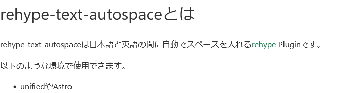
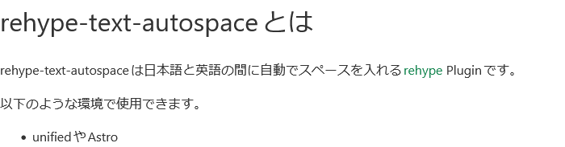

[](https://github.com/yuma140902/rehype-text-autospace/actions/workflows/CI.yml)
[](https://www.npmjs.com/package/rehype-text-autospace)

日本語と英語の間に間隔を開ける [rehype](https://github.com/rehypejs/rehype) プラグインです。

## 動作例

以下のマークダウンを rehype-text-autospace を使用して処理した結果と使用せずに処理した結果の比較です。

```md
# rehype-text-autospaceとは

rehype-text-autospaceは日本語と英語の間に自動でスペースを入れる[rehype](https://github.com/rehypejs/rehype) Pluginです。

以下のような環境で使用できます。

- unifiedやAstro
```

| rehype-text-autospace 無し | 
|---|
|  |

| rehype-text-autospace 有り |
|---|
|  |
