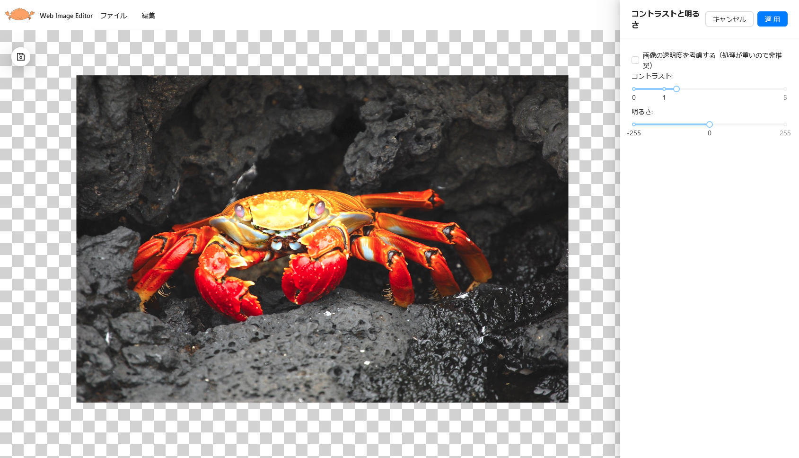

ブラウザ上で動作する画像エディタ。ユーザが指定した画像にフィルタをかける形で動作する。

 [^1]

[^1]: 画像の出典: <https://pixabay.com/ja/photos/%E3%82%AB%E3%83%8B-%E5%8B%95%E7%89%A9-%E9%87%8E%E7%94%9F%E5%8B%95%E7%89%A9-63084/>

## 機能

- グレースケール
- 二値化
- エッジ検出 (Canny 法)
- 色付きエッジ検出
- 漫画風加工
- 色の反転
- コントラスト
- 明るさ

## 使用した技術

- React
- TypeScript
- Vite
- Ant Design
- Konva
- OpenCV.js

