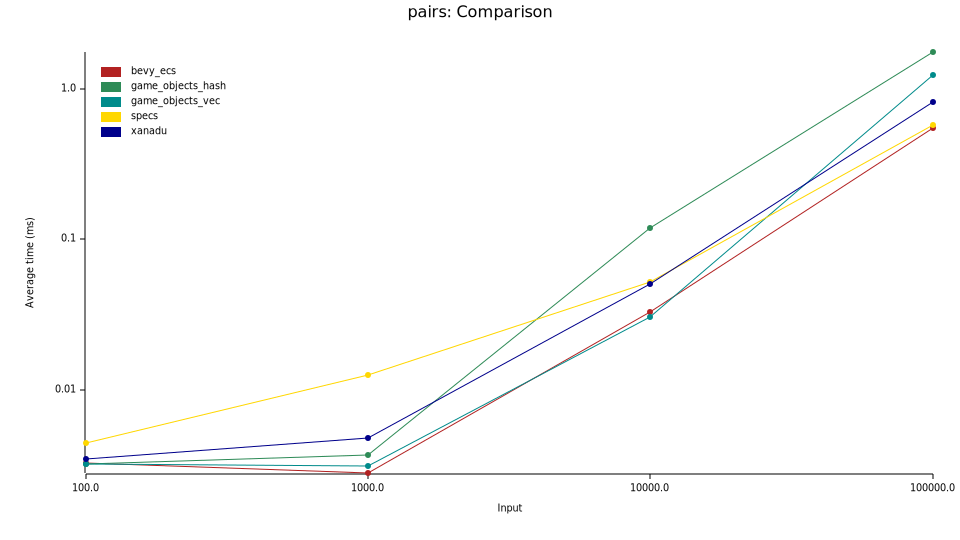

Rust 製の [Entity Component System (ECS)](https://ja.wikipedia.org/wiki/%E3%82%A8%E3%83%B3%E3%83%86%E3%82%A3%E3%83%86%E3%82%A3%E3%83%BB%E3%82%B3%E3%83%B3%E3%83%9D%E3%83%BC%E3%83%8D%E3%83%B3%E3%83%88%E3%83%BB%E3%82%B7%E3%82%B9%E3%83%86%E3%83%A0) ライブラリ。

勉強のために開発しているものであり、実用には耐えません。

## パフォーマンス

Xanadu と他の ECS ライブラリの比較です。あまり厳密なベンチマークではありません。コードは [bench.rs](https://github.com/yuma140902/Xanadu/blob/master/benchmark/benches/bench.rs) にあります。



| Number of entities | 10^2 (ns) | 10^3 (μs) | 10^4 (μs) | 10^5 (μs) |
| ------------------ | --------- | --------- | --------- | --------- |
| xanadu             |       184 |      1.39 |      19.4 |       452 |
| bevy_ecs           |       242 |      2.01 |      25.7 |       546 |
| specs              |      2380 |     10.03 |      43.3 |       610 |
| game_objects_vec   |       156 |      2.71 |      40.2 |      1002 |
| game_objects_hash  |       252 |      3.38 |     181.2 |      1948 |

*図・表: エンティティー数と処理時間の関係*

**環境**

- OS: Windows 11 Home 23H2
- CPU: Intel Core i7-12700
- RAM: Samsung DDR4 3200MHz 16GB x 2


## コード例

Xanadu を使用したコードの例です。

```rust
use xanadu::ecs::{
    PairComponentsRefIter, PairComponentsRefIterMut, SingleComponentExclusiveIter,
    SingleComponentExclusiveIterMut, World,
};

#[derive(Debug)]
pub struct Position {
    pub x: f64,
    pub y: f64,
    pub z: f64,
}

#[derive(Debug)]
pub struct Velocity {
    pub x: f64,
    pub y: f64,
    pub z: f64,
}

fn main() {
    let mut world = World::builder()
        .register_component::<Position>()
        .register_component::<Velocity>()
        .build();
    for i in 0..5 {
        let entity = world.new_entity();
        world.attach_component(
            entity,
            Position {
                x: i as f64,
                y: i as f64,
                z: i as f64,
            },
        );
    }
    for i in 0..3 {
        let entity = world.new_entity();
        world.attach_component(
            entity,
            Position {
                x: i as f64,
                y: i as f64,
                z: i as f64,
            },
        );
        world.attach_component(
            entity,
            Velocity {
                x: i as f64 * 0.1,
                y: i as f64 * 0.1,
                z: i as f64 * 0.1,
            },
        );
    }

    world.execute(print_system);
    world.execute(shuffle_system);
    world.execute(increment_system);
    world.execute(shuffle_system);
    println!("Shuffled and incremented");
    world.execute(print_system);
    println!("===================");
    world.execute(print2_system);
    println!("Applying velocity");
    world.execute(apply_velocity_system);
    world.execute(print2_system);
}

fn print_system(iter: SingleComponentExclusiveIter<'_, Position>) {
    for pos in iter {
        println!("Pos: [{}, {}, {}]", pos.x, pos.y, pos.z);
    }
}

fn shuffle_system(iter: SingleComponentExclusiveIterMut<'_, Position>) {
    for pos in iter {
        let tmp = pos.x;
        pos.x = pos.y;
        pos.y = pos.z;
        pos.z = tmp;
    }
}

fn increment_system(iter: SingleComponentExclusiveIterMut<'_, Position>) {
    for pos in iter {
        pos.x += 1.0;
        pos.y += 2.0;
        pos.z += 3.0;
    }
}

fn print2_system(iter: PairComponentsRefIter<'_, Position, Velocity>) {
    for (pos, vel) in iter {
        println!(
            "Pos: [{}, {}, {}] Vel: [{}, {}, {}]",
            pos.x, pos.y, pos.z, vel.x, vel.y, vel.z
        );
    }
}

fn apply_velocity_system(iter: PairComponentsRefIterMut<'_, Position, Velocity>) {
    for (mut pos, vel) in iter {
        pos.x += vel.x;
        pos.y += vel.y;
        pos.z += vel.z;
    }
}
```

出力

```
Pos: [0, 0, 0]
Pos: [1, 1, 1]
Pos: [2, 2, 2]
Pos: [3, 3, 3]
Pos: [4, 4, 4]
Pos: [0, 0, 0]
Pos: [1, 1, 1]
Pos: [2, 2, 2]
Shuffled and incremented
Pos: [2, 3, 1]
Pos: [3, 4, 2]
Pos: [4, 5, 3]
Pos: [5, 6, 4]
Pos: [6, 7, 5]
Pos: [2, 3, 1]
Pos: [3, 4, 2]
Pos: [4, 5, 3]
===================
Pos: [2, 3, 1] Vel: [0, 0, 0]
Pos: [3, 4, 2] Vel: [0.1, 0.1, 0.1]
Pos: [4, 5, 3] Vel: [0.2, 0.2, 0.2]
Applying velocity
Pos: [2, 3, 1] Vel: [0, 0, 0]
Pos: [3.1, 4.1, 2.1] Vel: [0.1, 0.1, 0.1]
Pos: [4.2, 5.2, 3.2] Vel: [0.2, 0.2, 0.2]
```
